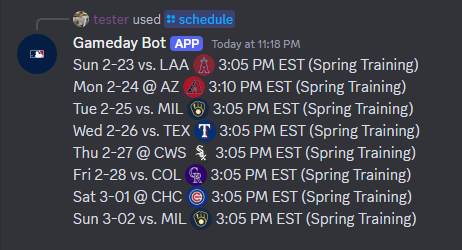
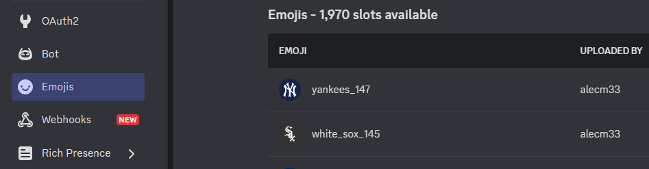

# MLB Gameday Bot ⚾


<br>
For demos of the bot's commands, view its github pages site here: https://alecm33.github.io/mlb-gameday-bot/

This bot and its author are not affiliated with the MLB. The bot uses the MLB Stats API, which is subject to the notice posted at http://gdx.mlb.com/components/copyright.txt

A Discord bot that integrates with the MLB Stats API to track your team of choice. For me, it's the Cleveland Guardians.

When running, the bot periodically polls for games in a 48-hour window centered on the current date. Whichever game is closest in time is considered
the "current" game, and will be the game for which a lot of the commands returns data. If there's a doubleheader, the bot may ask you to specify which game. If a game is live, the bot subscribes to its MLB.com Gameday live feed,
and in turn reports events to any number of subscribed Discord channels.

# Tech Stack

Written in JavaScript using [Discord.js](https://discord.js.org/).

The bot uses a PostgreSQL database to keep track of the Discord channels that have subscribed to the real-time gameday feature, and what their preferences are for how the bot reports. The benefits of this are scalability and ease of use - moderators in a given server can subscribe/unsubscribe/change the preferences of channels at any time via slash commands right in Discord. However, if you set up your own instance and only plan to have the bot report in one or two channels in a single server, this is kind of overkill. You could definitely edit the codebase to not use the database at all, and instead just supply your channel IDs (see [this support page on how to find such IDs](https://support.discord.com/hc/en-us/articles/206346498-Where-can-I-find-my-User-Server-Message-ID#h_01HRSTXPS5FMK2A5SMVSX4JW4E)) and the gameday reporting preferences for those channels directly to the code.

I integrate with the MLB stats API for a dizzying amount of data. Documentation _used_ to be very limited, but as of 2024, Google has provided some nice documentation here: https://github.com/MajorLeagueBaseball/google-cloud-mlb-hackathon/tree/main/datasets/mlb-statsapi-docs 

Shout out to Todd Roberts and his project for getting me acquainted with some of the subtleties, back when most documentation for the API was crowdsourced: https://pypi.org/project/MLB-StatsAPI/.

# Using my copy of the bot in your servers

My instance of the bot for the Cleveland Guardians is private. The bot is only designed to follow one team at a time. If you are interested in running this bot in your own server, feel free to reach out to me and I'd be happy to help get you started. Read below for an initial guide.

# Running your own copy of the bot

This will assume you are somewhat familiar with Node.js and developing Discord bots.

### Using Docker

Requires a machine with the [Docker](https://docs.docker.com/) Engine running.

1. Create a file called `.env` in the root directory, and populate it with the appropriate values. The `.env.example` file contains all the required variables with placeholder values. Each one is explained below.
    - DB_USER: the user for the postgres database
    - DB_PASSWORD: the password for the postgres database user
    - NODE_ENV: the node.js environment (production or development) in which to run the bot.
    - DB_NAME: the name for the postgres database
    - DB_PORT: the port for the postgres database
    - DISCORD_TOKEN: your discord bot's auth token **(sensitive)**
    - TEAM_ID: the id of the team you want the bot to follow. These match those of the "teams" resource in the MLB stats API: https://statsapi.mlb.com/api/v1/teams?sportId=1 . They are also stored statically in `config/globals.js`. Applicable commands will be configured for that team.
    - LOG_LEVEL: your chosen log level (info, error, warn, debug, or trace)
    - DISCORD_CLIENT_ID: the client ID of your Discord application
    - REQUIRE_SSL: whether the postgres database connection should require SSL.
    - TIME_ZONE: Your chosen time zone. Defaults to EST. Time zone names correspond to the Zone and Link names of the [IANA Time Zone Database](https://www.iana.org/time-zones), such as "UTC", "Asia/Shanghai", "Asia/Kolkata", and "America/New_York". Additionally, time zones can be given as UTC offsets in the format "±hh:mm", "±hhmm", or "±hh", for example as "+01:00", "-2359", or "+23".
2. Run `docker-compose up`

### Without Docker

1. Populate the following environment variables:
   - CLIENT_ID - your bot's client ID, AKA application ID.
   - DATABASE_STRING - a connection string for a PostgreSQL database instance. **(sensitive)**. That database should have the schema contained here in the file `database/schema.sql`. If requiring SSL, you'll need to place your cert in database/certs.
   - LOG_LEVEL - your chosen log level. 
   - TEAM_ID - the team you want to follow. These match those of the "teams" resource in the MLB stats API: https://statsapi.mlb.com/api/v1/teams?sportId=1 . They are also stored statically in `config/globals.js`. Every command will be configured for that team.
   - TOKEN - your bot's authentication token. **(sensitive)**
   - TIME_ZONE - Your chosen time zone. Defaults to EST. Time zone names correspond to the Zone and Link names of the [IANA Time Zone Database](https://www.iana.org/time-zones), such as "UTC", "Asia/Shanghai", "Asia/Kolkata", and "America/New_York". Additionally, time zones can be given as UTC offsets in the format "±hh:mm", "±hhmm", or "±hh", for example as "+01:00", "-2359", or "+23".

2. run `npm start`

### Optional - add emojis!

Discord allows applications to have up to 2,000 custom emojis. I have integrated team logo emojis into the app, to be used with
commands such as `/schedule`:



On the page for your application in the Discord Dev Portal, there is a section for Emojis. There you can upload images.
I recommend you use those I have stored here under /images/spots. Upload all 30, preserving the names. That should be all
that's necessary to start seeing them show up - they will be fetched when the bot starts up.



If the bot starts up successfully, the start-up logs look something like the following (subject to your log level):
```
LOG    Mon, 17 Mar 2025 21:13:15 GMT :  Ready!
LOG    Mon, 17 Mar 2025 21:13:15 GMT :  bot successfully logged in
LOG    Mon, 17 Mar 2025 21:13:15 GMT :  Subscribed channels: []
LOG    Mon, 17 Mar 2025 21:13:15 GMT :  Games: polling...
DEBUG  Mon, 17 Mar 2025 21:13:15 GMT :  https://statsapi.mlb.com/api/v1/schedule?hydrate=team,lineups&sportId=1&startDate=2025-03-16&endDate=2025-03-18&teamId=114
LOG    Mon, 17 Mar 2025 21:13:15 GMT :  Fetched application emojis.
TRACE  Mon, 17 Mar 2025 21:13:15 GMT :  Current game PKs: [
  {
    "key": 779092,
    "date": "2025-03-16",
    "status": "F"
  },
  {
    "key": 778815,
    "date": "2025-03-17",
    "status": "P"
  },
  {
    "key": 778921,
    "date": "2025-03-18",
    "status": "S"
  }
]
```

# Contributing

I welcome suggestions on new features or improvements. I also welcome proposals for collaboration. Just let me know.
