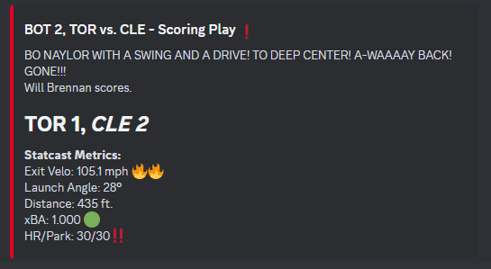

# MLB Gameday Bot ⚾
A bot that integrates with the MLB Stats API to track your team of choice. For me, it's the Cleveland Guardians.

When running, the bot periodically polls for games in a 48-hour window centered on the current date. Whichever game is closest in time is considered
the "current" game, and will be the game for which a lot of the commands returns data. If a game is live, the bot subscribes to its MLB.com Gameday live feed,
and in turn reports events to any number of subscribed Discord channels. 

Examples:

