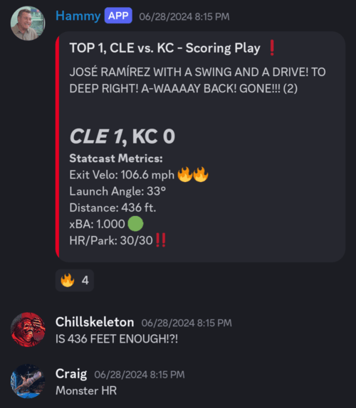
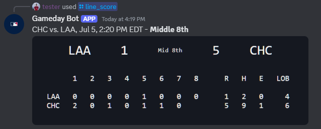
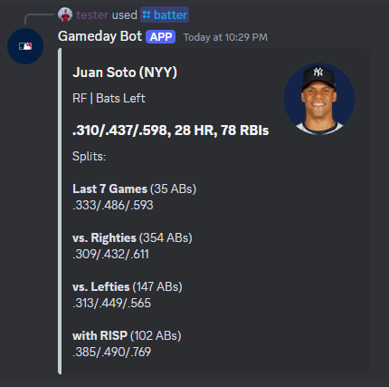
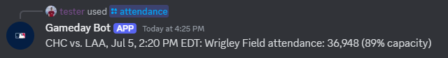

# MLB Gameday Bot ⚾
A bot that integrates with the MLB Stats API to track your team of choice.

When running, the bot periodically polls for games in a 48-hour window centered on the current date. Whichever game is closest in time is considered
the "current" game, and will be the game for which a lot of the commands returns data. If a game is live, the bot subscribes to its MLB.com Gameday live feed,
and in turn reports events to any number of subscribed Discord channels. 

## Demos

### /gameday_subscribe

This is arguably the centerpiece of the bot's functionality. For whichever team you configure it for, the bot will detect
when a game is live and report those updates to any subscribed Discord channels, respecting each channel's preferences:

The embeds are styled with contrasting colors from each team's color set. For balls in play, the bot will give Statcast metrics.
This includes not only exit velo, launch angle, and distance, but also xBA and HR/Park, which are sourced separately from the 
MLB Savant site. By default, the bot will report the result of each at bat, plus any key events that happen during at-bats,
such as baserunning events. If this is too much, the bot can be configured to report scoring plays only. Furthermore, if you wish
to avoid spoilers for people watching or listening on a delay, you can provide a delay from 0-180 seconds when subscribing.

For example, in a server for the Guardians, the bot has provided nice context right in the chat where people are following the game.
You can of course personalize it to have a bit more flair for your team:

### /lineup

### /starters

### /box_score

### /line_score

### /pitcher

### /batter

### /scoring_plays

### /highlights

### /standings

### /schedule

### /weather

### /attendance

